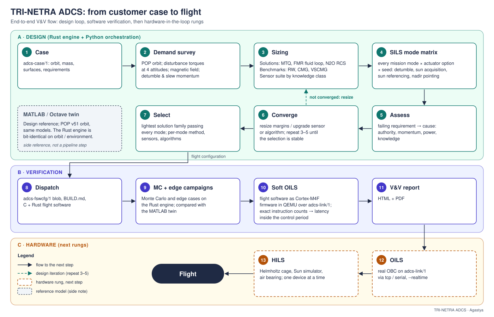

# Nodes of the design loop and verification chain

**Owner: Agastya.** Generated by `tools/nodes_doc.py` from `matlab_sils/data/pipeline/nodes.json`; `tools/pipeline.py` reads its parameters from the same file.

Every node of the design loop and verification chain: what it reads, what it writes, the parameters it runs with and the rules it applies. tools/pipeline.py reads its parameters from here (a changed parameter is a changed node); docs/NODES.md and the V&V report are generated from this file (python3 tools/nodes_doc.py).

| # | node | stage | runs in | inputs | outputs |
|---:|---|---|---|---|---|
| 1 | [`case`](#case) | input | file | — | matlab_sils/cases/<case>.csv |
| 2 | [`catalogue`](#catalogue) | input | file + Python (tools/catalogue.py derives the modelling block) | vendor datasheets and product pages (source_url in every file) | matlab_sils/data/catalogue/<vendor>_<model>.json (adcs-datasheet/1) |
| 3 | [`demand`](#demand) | design | Rust (adcs-design::demand) | case | iter_k/sized/sizing.json -> demand |
| 4 | [`size_mtq`](#size_mtq) | design | Rust (adcs-design::mtq) | demand knobs.scale.mtq, knobs.scale.mtqp | parts/SZ-<case>-MTQ.json parts/SZ-<case>-MTQP.json |
| 5 | [`size_fmr`](#size_fmr) | design | Rust (adcs-design::fmr, empump) | demand knobs.scale.fmr, knobs.fmr_lambda, knobs.fmr_flow_sigma | parts/SZ-<case>-FMR-{X,Y,Z}.json |
| 6 | [`size_rcs`](#size_rcs) | design | Rust (adcs-design::rcs) | demand knobs.scale.rcs | parts/SZ-<case>-RCS.json |
| 7 | [`select_rotor`](#select_rotor) | design | Rust (adcs-design::catalogue) | demand catalogue (selectable models only) knobs.scale.rw, knobs.scale.cmg, knobs.scale.vscmg | parts/CAT-<vendor>-<model>.json (-VSCMG for the variable-speed use), with the candidates and the rule in its sizing block |
| 8 | [`size_sensors`](#size_sensors) | design | Rust (adcs-design::size_all) | demand knobs.star_tracker, knobs.st_heads, knobs.gyro_grade | products/SZ-<case>-<family>.json |
| 9 | [`budget`](#budget) | design | Rust (adcs-design::budget) | size_mtq size_fmr size_rcs select_rotor size_sensors | sizing.json -> families.<id>.{mass_kg, power_W, volume_L, items} |
| 10 | [`matrix`](#matrix) | SILS | Rust engine + C flight software (adcs run) | budget (products) matlab_sils/data/modes/*.json | matlab_sils/store/pipeline/cache/<key>/manifest.json |
| 11 | [`assess`](#assess) | SILS | Python (tools/pipeline.py) | matrix | iter_k/assess.json |
| 12 | [`tune`](#tune) | SILS | Rust engine + C flight software (through matrix) | converge (the options to tune) matrix | the tuned variants law@key=value,... in the matrix and in the dispatched mission's fsw block |
| 13 | [`converge`](#converge) | design | Python (tools/pipeline.py) | assess select mc (robustness feedback) | loop.json |
| 14 | [`faults`](#faults) | selection | Rust engine + C flight software (adcs run) | converge (the converged products) select (each family's best option and algorithms per mode) | matlab_sils/store/pipeline/<case>/faults.json matlab_sils/store/pipeline/<case>/faults/<family>/<kind>.json (the scenarios flown) |
| 15 | [`select`](#select) | selection | Python (tools/pipeline.py) | assess budget case (req.mass, req.vol) faults | selection.json |
| 16 | [`dispatch`](#dispatch) | dispatch | Rust (adcs dispatch) | select budget | dist/dispatch/<case>/<family>/converged/ |
| 17 | [`certify`](#certify) | verification | Python (tools/floquet.py) | family_missions (the coils-only package and its mission run) | matlab_sils/store/pipeline/<case>/floquet.json |
| 18 | [`mc`](#mc) | verification | Rust engine | dispatch | matlab_sils/store/pipeline/<case>/mc/summary.json selection.json -> robustness |
| 19 | [`family_missions`](#family_missions) | verification | Rust engine + C and Rust flight software | select budget | matlab_sils/store/pipeline/<case>/families.json matlab_sils/store/pipeline/<case>/families/<family>/{package,dispatch,mc}/ |
| 20 | [`soft_oils`](#soft_oils) | verification | Rust engine + QEMU (Cortex-M4F) | dispatch | matlab_sils/store/pipeline/<case>/soft_oils.json |
| 21 | [`report`](#report) | report | Python | select dispatch mc soft_oils nodes | results/DESIGN_<case>.md results/vv/ dist/TRINETRA_ADCS_VV_report.pdf |

## case

The customer case: orbit, mass properties, surfaces, requirements and budgets (adcs-case/1).

- **Stage:** input. **Runs in:** file.
- **Inputs:** none.
- **Outputs:** matlab_sils/cases/<case>.csv.

Rules:

- every requirement names its source (stated by the user, or UNCONFIRMED with a plan reference)
- the case file is part of every cached run's key: a changed requirement re-flies the matrix

## catalogue

Bought actuators as their datasheets state them: CubeSpace, AAC Clyde Space and Rocket Lab reaction wheels, Tensor Tech control moment gyroscopes. One file per model with the datasheet numbers, the source URL and the model parameters derived from them (each derived value says how).

- **Stage:** input. **Runs in:** file + Python (tools/catalogue.py derives the modelling block).
- **Inputs:** vendor datasheets and product pages (source_url in every file).
- **Outputs:** matlab_sils/data/catalogue/<vendor>_<model>.json (adcs-datasheet/1).

| parameter | value |
|---|---|
| `vendors` | CubeSpace, AAC Clyde Space, Rocket Lab, Tensor Tech |

Rules:

- a number not on the datasheet is null in the datasheet block, never guessed
- model parameters the engine needs but the datasheet omits (rotor inertia, friction, imbalance) are derived and marked derived, with the rule
- RW, CMG and VSCMG are bought: they are selected from the catalogue, never sized by a law

## demand

What the case asks of an actuator: one orbit on the POP orbit at four held attitudes with the SILS torque models; peak disturbance, cyclic and secular momentum, weakest field, detumble and slew momentum.

- **Stage:** design. **Runs in:** Rust (adcs-design::demand).
- **Inputs:** case.
- **Outputs:** iter_k/sized/sizing.json -> demand.

| parameter | value |
|---|---|
| `k_h` | momentum margin: 2, or 1/(1 - req.hsat) |
| `k_tau` | 1.5 |

Rules:

- h_req = k_h x max(cyclic + secular per orbit, slew momentum)
- tau_req = k_tau x max(peak disturbance, slew torque)
- fine class when req.ake <= 0.05 deg (star tracker, precision gyro)

## size_mtq

Our magnetorquer coils, sized: the largest of the dumping, momentum and detumble dipoles.

- **Stage:** design. **Runs in:** Rust (adcs-design::mtq).
- **Inputs:** demand, knobs.scale.mtq, knobs.scale.mtqp.
- **Outputs:** parts/SZ-<case>-MTQ.json, parts/SZ-<case>-MTQP.json.

| parameter | value |
|---|---|
| `floor_Am2` | 0.05 |
| `anchor` | SYN-CT-1: mass 0.03 kg, 0.3 W per 0.45 Am2 |

Rules:

- m = max(2 tau_dist/(0.5 B_min), 2 h_secular/(0.3 B_mean T), h_detumble/(0.3 B_mean t_detumble/2))
- the coils-only family carries the pointing-grade coil (at least twice the dumping dipole)

## size_fmr

Our fluid momentum loop, one ring per axis, designed with its electromagnetic DC conduction pump (no permanent magnet).

- **Stage:** design. **Runs in:** Rust (adcs-design::fmr, empump).
- **Inputs:** demand, knobs.scale.fmr, knobs.fmr_lambda, knobs.fmr_flow_sigma.
- **Outputs:** parts/SZ-<case>-FMR-{X,Y,Z}.json.

| parameter | value |
|---|---|
| `electrode_current_max_A` | 10 |
| `iron_flux_T` | 1.2 |
| `fluid` | galinstan |
| `cruise_fraction` | 0.4 |

Rules:

- grid over flow speed, bore, gap field and pump length; keep the least mass + lambda x steady power that meets h_req and tau_req
- torque capacity = I_max B / b x 2 S A / L; coil m_cu = sqrt(lambda K)

## size_rcs

Our N2O cold-gas RCS, 6 couples: thrust class and propellant tank.

- **Stage:** design. **Runs in:** Rust (adcs-design::rcs).
- **Inputs:** demand, knobs.scale.rcs.
- **Outputs:** parts/SZ-<case>-RCS.json.

| parameter | value |
|---|---|
| `isp_budget_s` | 60 |
| `thrust_classes_N` | 0.005, 0.01, 0.02, 0.05, 0.1 |
| `meop_bar` | 70 |

Rules:

- thrust: the smallest class above the couple the detumble and slew need
- propellant: detumble + dumping over life, 1.2 margin

## select_rotor

The benchmarks' momentum actuators chosen from the catalogue: for RW three orthogonal wheels, for CMG and VSCMG a four-unit 54.74 deg pyramid.

- **Stage:** design. **Runs in:** Rust (adcs-design::catalogue).
- **Inputs:** demand, catalogue (selectable models only), knobs.scale.rw, knobs.scale.cmg, knobs.scale.vscmg.
- **Outputs:** parts/CAT-<vendor>-<model>.json (-VSCMG for the variable-speed use), with the candidates and the rule in its sizing block.

| parameter | value |
|---|---|
| `rw_units` | 3 |
| `cmg_units` | 4 |
| `pyramid_deg` | 54.74 |
| `per_unit_need` | rw: h_max >= h_req x scale and torque >= tau_req x scale (three wheels, one per axis) cmg: h_max >= h_req/2 x scale and torque >= tau_req/2 x scale (a pyramid puts about two units on any axis) vscmg: as cmg; the rotor runs at half its momentum so its speed can move both ways |
| `choose` | the lightest model that meets the need; ties by steady power, then volume |
| `selectable` | a catalogue model whose datasheet states momentum, torque, mass and steady power (tools/catalogue.py) |

Rules:

- when no model meets the need the largest is taken and the gap is reported (the loop cannot size it up)
- an authority increase from the converge node raises the need, so the next model up is chosen

## size_sensors

The sensor set of every product: magnetometer, six sun sensors, gyro, GNSS, Earth sensor; the star tracker on the fine class or when knowledge asks for it.

- **Stage:** design. **Runs in:** Rust (adcs-design::size_all).
- **Inputs:** demand, knobs.star_tracker, knobs.st_heads, knobs.gyro_grade.
- **Outputs:** products/SZ-<case>-<family>.json.

| parameter | value |
|---|---|
| `star_tracker` | SYN-ST-1 |
| `st_heads_default` | 2 |
| `gyro_fine` | TRN-GYRO-P1 |
| `gyro_coarse` | SYN-GYRO-1 |

Rules:

- gyro grade g: noise x g, mass and power / g (fibre-optic class below 1)

## budget

Each family's product: mass, steady power and volume summed over every fitted unit.

- **Stage:** design. **Runs in:** Rust (adcs-design::budget).
- **Inputs:** size_mtq, size_fmr, size_rcs, select_rotor, size_sensors.
- **Outputs:** sizing.json -> families.<id>.{mass_kg, power_W, volume_L, items}.

Rules:

- units per fill = number of axes / spin axes / boresights; the six sun sensors count as one part

## matrix

Every mission mode x actuator option x seed on the sized products; options that fail on performance also fly every algorithm of their slot.

- **Stage:** SILS. **Runs in:** Rust engine + C flight software (adcs run).
- **Inputs:** budget (products), matlab_sils/data/modes/*.json.
- **Outputs:** matlab_sils/store/pipeline/cache/<key>/manifest.json.

| parameter | value |
|---|---|
| `seeds` | 1, 2 |
| `cache_key` | scenario, product, parts, seed, flight-software build, case file |
| `algorithm_candidates` | detumble: bdot_gyro, bdot_mag, bdot_bangbang, genbdot_l1 sun_acquisition: sunspin_damped, sunspin_l1l2, sunspin_l1l2_e2, sunspin_deruiter2011, sun_boresight_celani2026 mtq_pointing: mtq_pd, mtq_lqr, mtq_smc, mtq_rate_damp, mtq_lovera2004, mtq_celani2015, mtq_avanzini2021, mtq_celani2026, mtq_tango2013 pointing: pid, lqr, smc, pid@bw2.5, pid@bw4 |

Rules:

- a run is scored against the case's requirements at run time
- channels are deleted after scoring (the manifest is kept)
- the coils-only laws of the magnetorquer literature review (docs/MTQ_LITERATURE.md) are candidates of their slots like every other law

## assess

Per option: feasible on every seed? Each failing requirement classed; the best algorithm per option kept.

- **Stage:** SILS. **Runs in:** Python (tools/pipeline.py).
- **Inputs:** matrix.
- **Outputs:** iter_k/assess.json.

| parameter | value |
|---|---|
| `classes` | power*: power ake*: knowledge propellant*: propellant otherwise: performance |
| `violation` | value / requirement - 1 (10 when not finite) |

Rules:

- rank an option's variants by (not feasible, failing count, worst objective)

## tune

Bruni & Celani 2017 (P7) min-max gain selection: for a coils-only option that still fails on performance after every law of its slot has flown, or passes with a thin margin,, every law is flown at every point of a gain grid, on extra seeds; each law keeps the gains whose worst seed is best, and assess then ranks the laws by that worst case.

- **Stage:** SILS. **Runs in:** Rust engine + C flight software (through matrix).
- **Inputs:** converge (the options to tune), matrix.
- **Outputs:** the tuned variants law@key=value,... in the matrix and in the dispatched mission's fsw block.

| parameter | value |
|---|---|
| `grids` | mtq_pointing: mtq_gain_p: 0.25, 1, 4 mtq_gain_d: 0.25, 1, 4 handover_out_dps: 0.25, 0.5, 1.0 sun_acquisition: spin_rate_dps: 2, 4, 6 ss_gain: 0.3, 1, 3 |
| `extra_seeds` | 3, 4 |
| `actuators` | mtq |
| `objective` | worst seed: (not feasible, failing count, objective) |
| `margin` | 0.5 |

Rules:

- mtq_gain_p / mtq_gain_d scale the proportional and rate gains of every magnetic pointing law (for Avanzini: lambda and k)
- spin_rate_dps sets the commanded spin (Roldugin: wobble grows with it) and ss_gain the Sun-law gains
- the grid is a derivative-free search as in the paper, coarse (3 x 3) to keep the matrix inside minutes
- handover_out_dps is the rate error below which the pointing law takes over from the despin after the Sun spin (05_control.md); it is tuned with the gains because the coils-only nadir test starts from the spin
- an option that passes but whose worst seed uses more than margin x its requirement is tuned too (the Monte Carlo finds thin margins)

## converge

The knob changes the failures call for; converged when nothing is left to change.

- **Stage:** design. **Runs in:** Python (tools/pipeline.py).
- **Inputs:** assess, select, mc (robustness feedback).
- **Outputs:** loop.json.

| parameter | value |
|---|---|
| `scale_bounds` | 0.5, 4.0 |
| `scale_up` | 1.5 |
| `scale_down` | 0.75 |
| `improvement_needed` | 0.05 |
| `fmr_lambda_bounds_kg_W` | 0.01, 3.0 |
| `fmr_flow_sigma_min_m_s` | 5e-05 |
| `gyro_grade_min` | 0.1 |
| `max_iterations` | 24 |

Rules:

- performance: fly every algorithm of the slot, then (fluid loop) a quieter flow sensor /4, then authority x1.5; undone when the violation does not fall by 5 %
- rate stability (fine class): gyro noise x0.3 down to x0.1; undone when it does not improve
- knowledge: fit the star tracker on a coarse product
- power, fluid loop: pump lambda x3 (not for RCS valve power); coils-only: coil authority x0.75; rotors: blocked (standby power is the floor)
- mass over budget, closest solution family: lighter gyro, one star-tracker head, lambda /3, fluid-loop momentum x0.75 -- each undone and closed if it breaks a mode or raises the violation by more than 5 %
- propellant: RCS x1.5
- a part pushed up by one failure and down by another is frozen and reported as a conflict

## faults

Redundancy and FDIR in selection (B2.6): once the loop has converged, every family of the campaign's roles flies its mission (detumble -> Sun acquisition -> nadir, as dispatch builds it, with the family's best option and algorithms per mode) once without a fault and once per single fault its product can carry; select then counts every fault the family does not survive (select.fault_policy).

- **Stage:** selection. **Runs in:** Rust engine + C flight software (adcs run).
- **Inputs:** converge (the converged products), select (each family's best option and algorithms per mode).
- **Outputs:** matlab_sils/store/pipeline/<case>/faults.json, matlab_sils/store/pipeline/<case>/faults/<family>/<kind>.json (the scenarios flown).

| parameter | value |
|---|---|
| `roles` | solution |
| `seeds` | 1, 2 |
| `lead_orbits` | 0.25 |
| `set` | kind coil_fail; needs coils; index 1 kind rotor_fail; needs rotors; index 1 kind gimbal_stuck; needs gimbals; index 1 kind st_head_fail; needs st_heads; min_units 2; index 2 kind gyro_bias_step; needs gyros; value 0.001745, 0.0, 0.0 kind gps_outage; needs gnss; duration_s 1800.0 kind rcs_valve_fail; needs rcs_couples; index 1 |
| `units` | coils, rotors (wheels, fluid rings, CMG/VSCMG rotors), gimbals, st_heads, gyros, gnss, magnetometers, rcs_couples: counted from the product's fill as the engine counts them |

Rules:

- one fault per run, injected lead_orbits (a quarter orbit) before the requirement window opens (the mission's last half orbit), so the whole judged window flies with the fault; a gps_outage lasts duration_s (1800 s, as scenarios/fault_gps_img.toml) and ends inside the window
- a fault is flown only when the product carries at least min_units (default 1) of what it needs: one coil, one rotor (a fluid ring is a rotor), one gimbal when it has gimbals, the second star-tracker head only when it has two, a gyro bias step of 0.1 deg/s on x (as scenarios/fault_gyro_ais.toml), a GNSS outage, one RCS couple's valve when it has RCS; a skipped fault says why
- mag_fail is not in the set: a magnetometer silent for 60 s puts the flight software in safe mode by design (B1.5), so the window would judge safe mode, not pointing; it can be added to the set
- pass rule: on every seed, every requirement metric that passes in the fault-free run still passes under the fault; a metric that already fails without the fault is recorded (also_fails_without_fault), not counted against the fault; a faulted or fault-free run that does not fly fails the fault
- each fault the family does not survive is one gap "fault: <kind>: <failing metrics>", counted by select under select.fault_policy
- a fault kind the engine does not inject, a unit name that is not one, or an index the product does not have is refused
- runs are cached by the hash of (scenario, product, parts, seed, flight-software build, case file), as the matrix's; no knob responds to a fault gap (redundancy is not a sizing knob yet)

## select

Scores every family (ours and the benchmarks) on the same modes and budget, then picks the minimum feasible solution; the benchmarks are ranked by the same rule as the comparison.

- **Stage:** selection. **Runs in:** Python (tools/pipeline.py).
- **Inputs:** assess, budget, case (req.mass, req.vol), faults.
- **Outputs:** selection.json.

| parameter | value |
|---|---|
| `feasible` | every mode passes with a usable option on every seed, and mass <= req.mass, volume <= req.vol; under fault_policy gap, also every single fault of node faults survived |
| `rank_feasible` | mass_kg, power_W, volume_L, simplicity |
| `rank_infeasible` | gap_count, mass_kg |
| `select_role` | solution |
| `compare_role` | benchmark |
| `fault_policy` | gap |

Rules:

- selected = the feasible solution family first in rank_feasible order (least mass, then power, then volume)
- when no solution family is feasible the closest one is named with its gaps
- benchmark = the same ranking over the benchmark families, reported beside the selection
- select runs in every iteration without the fault campaign; once the loop has converged node faults flies and select runs again counting it, before dispatch
- fault_policy gap: a single fault the family does not survive is a gap, so the family is not feasible; fault_policy rank: a fault gap leaves feasibility alone and the number of failed faults leads both rankings
- a family of a role the fault campaign flies that has no fault record is refused, never counted as surviving; families of other roles (the benchmarks) are not flown under faults and carry no fault gap

## dispatch

The selected family's mission (detumble -> Sun acquisition -> nadir), its adcs-fswcfg/1 blob, the converged products; C and Rust checked bit-identical.

- **Stage:** dispatch. **Runs in:** Rust (adcs dispatch).
- **Inputs:** select, budget.
- **Outputs:** dist/dispatch/<case>/<family>/converged/.

| parameter | value |
|---|---|
| `nadir_at_orbits` | 2 |
| `nadir_orbits` | rotors: 1 coils_only: 3 |
| `duration_orbits` | nadir_at_orbits + nadir_orbits: detumble and Sun acquisition, then nadir (the metrics take the last half orbit) |

Rules:

- the C and Rust flight software must agree bit for bit
- a coils-only nadir is given three orbits after the command: the Sun-spin hand-over (despin, then magnetic capture) takes about two

## certify

Celani 2026 (P8) method: Floquet multipliers of the coils-only nadir loop linearised about the reference, with the gains the coils-only family dispatches and the magnetic field along one orbit; all |mu| < 1 certifies local exponential stability of the periodic loop.

- **Stage:** verification. **Runs in:** Python (tools/floquet.py).
- **Inputs:** family_missions (the coils-only package and its mission run).
- **Outputs:** matlab_sils/store/pipeline/<case>/floquet.json.

| parameter | value |
|---|---|
| `field` | aligned dipole, 7.94e15 T m^3, in the orbit frame |
| `frame` | reference body frame from the mission's own nadir phase (truth attitude) |
| `steps_per_orbit` | 2000 |

Rules:

- theta_dot = w, J w_dot = Gamma(t) tau(theta, w) with Gamma = I - b b^T; gyroscopic and gravity-gradient terms left out, as in the papers' averaging analyses
- a boresight law leaves the rotation about its boresight free: one multiplier stays at 1 by design

## mc

Monte Carlo of the dispatched mission with the case's dispersions (truth dispersed, flight software nominal). It feeds back: a requirement that fails in any dispersed run is a failure the loop must fix.

- **Stage:** verification. **Runs in:** Rust engine.
- **Inputs:** dispatch.
- **Outputs:** matlab_sils/store/pipeline/<case>/mc/summary.json, selection.json -> robustness.

| parameter | value |
|---|---|
| `runs` | 12 |
| `robustness_passes` | 3 |

Rules:

- dispersions generated from the case (tools/pipeline_verify.py case_dispersions, catalogue/dispersions.toml): orbit draws centred on the case orbit, inertia and residual-dipole spread from mass.iunc / magnetic.dunc when stated; drawn as asils.campaign.draw
- every requirement metric must pass in every run; otherwise, for the selected family:
- power -> pump with more copper (lambda x3) and the lighter-pump lever closed
- performance -> the family's authority x1.5 and its authority-down lever closed
- knowledge -> the star tracker on a coarse product
- the loop then runs on from the new knobs (sizing, matrix, converge, select, dispatch, mc) up to robustness_passes times

## family_missions

Every one of our solution families, selected or not (coils only, coils + fluid loop, coils + fluid loop + RCS), dispatched and flown as the full mission (detumble -> Sun acquisition -> nadir) with its best methods from the loop, in C and Rust, and by Monte Carlo, so each family's behaviour is on record beside the selection.

- **Stage:** verification. **Runs in:** Rust engine + C and Rust flight software.
- **Inputs:** select, budget.
- **Outputs:** matlab_sils/store/pipeline/<case>/families.json, matlab_sils/store/pipeline/<case>/families/<family>/{package,dispatch,mc}/.

| parameter | value |
|---|---|
| `role` | solution |
| `monte_carlo_runs` | as node mc |

Rules:

- the selected family reuses its dispatch and mc outputs
- a family that is not feasible is still flown: its gaps show in its mission metrics
- C and Rust must agree bit for bit for every family

## soft_oils

The dispatched mission with the flight software as firmware (C and Rust) beside its SILS run; exact instruction timing and bus latency.

- **Stage:** verification. **Runs in:** Rust engine + QEMU (Cortex-M4F).
- **Inputs:** dispatch.
- **Outputs:** matlab_sils/store/pipeline/<case>/soft_oils.json.

| parameter | value |
|---|---|
| `obc_mhz` | 168 |
| `cpi` | 1.25 |
| `i2c_khz` | 400 |
| `spi_mhz` | 1 |
| `can_kbps` | 1000 |

Rules:

- a latency >= the control step counts as an overrun
- a missing instruction count stops the run

## report

The design ledger per case and the V&V report (HTML and PDF).

- **Stage:** report. **Runs in:** Python.
- **Inputs:** select, dispatch, mc, soft_oils, nodes.
- **Outputs:** results/DESIGN_<case>.md, results/vv/, dist/TRINETRA_ADCS_VV_report.pdf.

Rules:

- every table is generated from the stored node outputs, never typed
